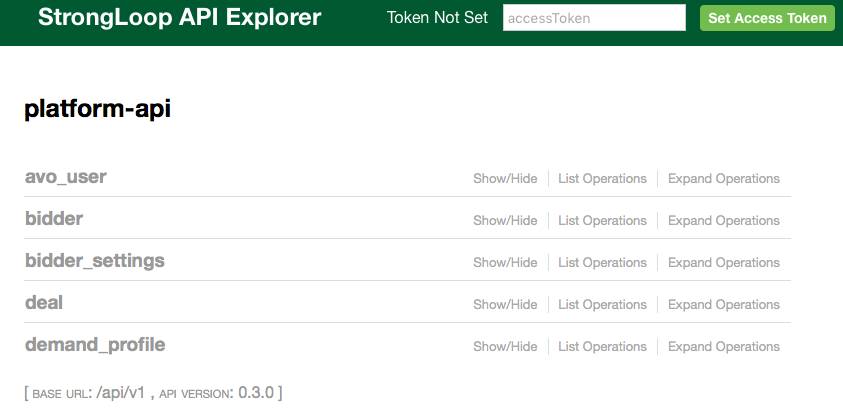
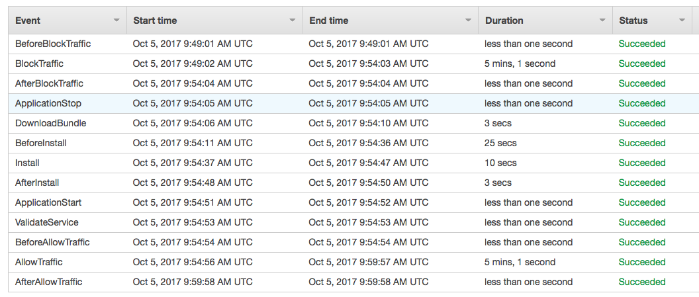

title: This week I learned about
date: 2017-10-07
category: technical
published: true
summary: CORS, EmberJS, AWS CodeDeploy, dotenv and APIs

The first week of October was quite full of interesting/useful things/lessons.
Here are some of them:

### Loopback.io

Besides all other goodies, I found that services at work using [loopback](http://loopback.io/doc/index.html)
offer a [component-explorer](https://github.com/strongloop/loopback-component-explorer)
where you can interact and learn more about the APIs exposed.

### Preflight requests

When you make a [cross-origin request](https://developer.mozilla.org/en-US/docs/Web/HTTP/Access_control_CORS) 
from javascript in the browser, the browser will ask the endpoint first if the request is allowed with a [preflight request](https://developer.mozilla.org/en-US/docs/Glossary/Preflight_request). 
This usually adds up a lot of time if you do it every time and have multiple 
endpoints for a single visualization.

In the front-end app, I was working, the browser was always sending those requests
every time. You can cache the answers with the [Access-Control-Max-Age](https://developer.mozilla.org/en-US/docs/Web/HTTP/Headers/Access-Control-Max-Age)
header, and I don't know why the `cors` and `kcors` library we were using had
`maxAge` disabled by default. This is making some pages loading time almost twice.

### Ember models

In EmberJS your route components can load a model. We had front-end routes like
`user/application/adunit/action` But we were loading almost everything in the last 
element of the route path.

This leads to repeated code in the path leaves with complex `model()` hooks where
you load many things that should be already there making the app slow. A small
refactor made page loads feel snappier.

### Too much authentication 

Besides preflight requests and loading too many things, our front-end is
personalized depending on the role. We were not caching user roles so we were
asking the back-end on almost every page for those roles.

### React dotenv

The [react-scripts](https://github.com/facebookincubator/create-react-app/tree/master/packages/react-scripts) package in React includes [dotenv](https://github.com/motdotla/dotenv) as a way to manage
environment configuration through files. Last week a new `local` environment
was created and a `.env.local` file was added. But it seems that `.env.local` has
a special meaning in `dotenv` and it was overriding my personal `.env` file.

How this happened is another lesson: someone that doesn't develop the project did
the changes that broke the development environment. I believe working in pairs/more close with that
person would have avoided this plus bringing a colleague in another location closer to the team.

### AWS CodeDeploy long waiting times

While deploying the fix for the `Access-Control-Max-Age` backend issue. I was
annoyed at how long it took [AWS CodeDeply](https://aws.amazon.com/codedeploy/).

The `BlockTraffic` and `AllowTraffic` steps took 10 minutes from the 11 minutes
deploy. It seems the long wait is due to health check configuration in the
`Elastic Load Balancer` of the service: 10 checks
every 30 seconds to raise a trigger, that's 5 minutes.

### Linkerd

Our systems engineering team is setting up new infrastructure management and
deploying system for a [greenfield project](https://en.wikipedia.org/wiki/Greenfield_project). One of the core
tools is [linkerd](https://linkerd.io) to help with service-to-service
communication.

### Learned to appreciate Nomad

Besides `Linkerd`, this new project uses almost every tool from [Hashicorp](https://www.hashicorp.com).
I've used `Terraform` and `Packer` before but [Nomad](https://www.nomadproject.io) was 
a tool I couldn't find a use for. And this was till I saw all these tools working
together (Kudos to Avocarrot sysengs). I still like [Kubernetes](https://kubernetes.io)
more as a whole, but I was able to appreciate nomad as a tool for a specific job.
